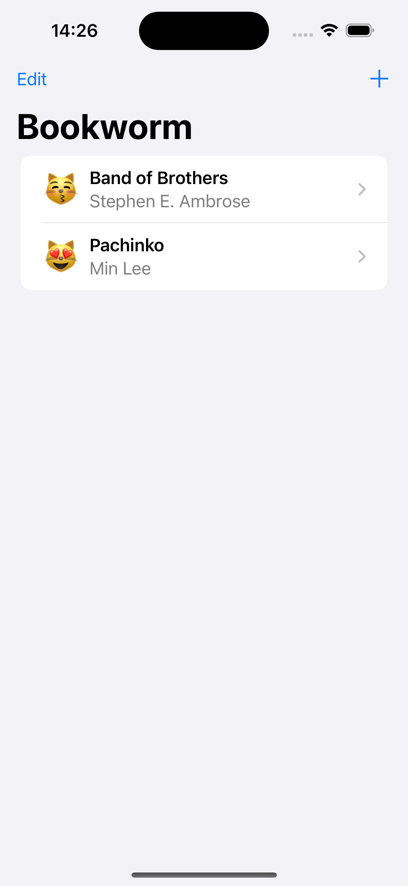
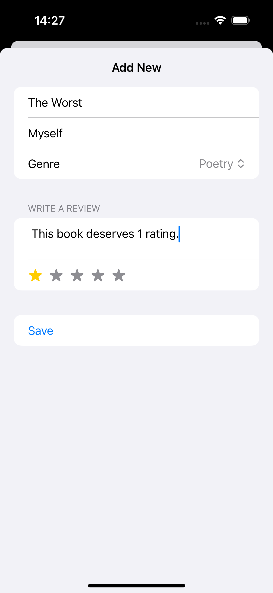
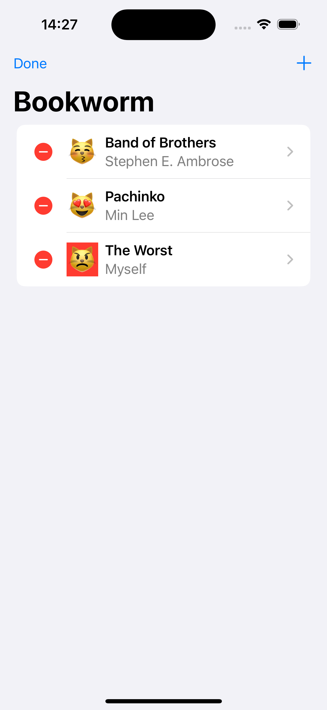

# Bookworm

Bookworm is a SwiftUI application that allows users to keep track of the books they are reading, have read, and want to read. It provides a user-friendly interface to manage your book collection, rate books, and leave reviews.

## Features

- **Add Books**: Easily add books to your reading list.
- **Ratings & Reviews**: Rate the books you've read and write reviews.
- **Organize Your Collection**: Categorize books as "Fantasy", "Thriller", or "Poetry".

## Screenshots






## Requirements

- iOS 14.0+
- Xcode 12.0+
- Swift 5.3+

## Installation

1. Clone the repository:
   ```sh
   git clone https://github.com/yourusername/bookworm.git
   ```
2. Open the project in Xcode:
   ```sh
   cd bookworm
   open Bookworm.xcodeproj
   ```
3. Build and run the app on your simulator or device.

## Usage

1. **Add a Book**: Tap the "Add" button and fill in the book details.
2. **Rate and Review**: After finishing a book, rate it and leave a review to help others discover great reads.

## License

Bookworm is available under the MIT License. See the [LICENSE](LICENSE) file for more info.

Happy Reading! 📚
